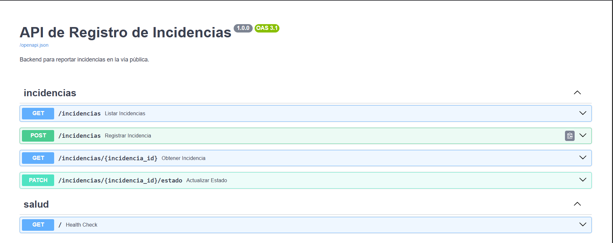

# Evidencias — Backend

API REST construida con FastAPI. La documentación interactiva se genera
automáticamente y está disponible en `http://localhost:8000/docs`.

## Endpoints

| Método  | Ruta                        | Caso de uso |
|---------|-----------------------------|-------------|
| `POST`  | `/incidencias`              | CU-01       |
| `GET`   | `/incidencias`              | CU-02       |
| `GET`   | `/incidencias/{id}`         | CU-02       |
| `PATCH` | `/incidencias/{id}/estado`  | CU-03       |

## Documentación de la API (Swagger)

